<!-- ===================== HEADER ===================== -->
<h1 align="center">Hi 👋, I'm Arul Pandita</h1>

  

  

  

  

  

---

## 🚀 About Me

🎓 MS in Data Science @ Johns Hopkins University  
📍 Baltimore, MD  
💼 Data Scientist | Data Engineer | ML Engineer | Data Analyst | AI Engineer  

I design production-grade data systems and machine learning models that convert raw data into high-impact insights.

🔹 Experience across Data Science + Data Engineering + NLP Research  
🔹 Built systems processing 50K+ records/day  

---

## 🧠 Tech Arsenal

  

  

  

  

---

## 🚀 Featured Projects and Research Papers

### 🧠 [NLP Sentiment Analysis Engine](https://github.com/arulpanditaa/Stem-university-sentiment-analysis)

✔ 5,735 Reddit posts across 16 universities  
✔ BERT achieved 84.5% test accuracy  
✔ DistilBERT reached ~85% validation accuracy  
✔ End-to-end NLP and model evaluation pipeline  

---

### ⚽ [Football Legend GNN: Graph-Based Legend Prediction System](https://github.com/arulpanditaa/football-legend-gnn)

✔ 3,277 players · 207,676 teammate edges  
✔ GAT + player statistics hybrid model  
✔ ROC-AUC ≈ 0.97  
✔ 16 seasons of Premier League & La Liga data  

---

### 🎵 [MusicIR: Graph-Based Music Recommendation System](https://github.com/arulpanditaa/MusicIR-Music-Recommendation-System-)

✔ 154 artists · 114,000 Spotify tracks  
✔ TF-IDF + Graph hybrid recommendation model  
✔ 92.6% Precision@5  
✔ Interactive recommendation application  

---

### 🍎 [Food Affordability, Health & Healthcare Cost Prediction](https://github.com/arulpanditaa/Learning-Food-Affordability-Representations-to-Predict-Obesity-Diabetes-and-Healthcare-Costs-in-US)

✔ ~3,100 U.S. counties · 9 public data sources  
✔ Autoencoders + PCA + XGBoost  
✔ Double Machine Learning via EconML  
✔ $3.50/meal policy tipping point  
✔ $2.4B+ projected Medicare savings  

---

### 🌍 [Multilingual Reference-Free Machine Translation Quality Estimation](https://github.com/arulpanditaa/A-Multilingual-Approach-to-Reference-Free-Quality-Estimation-in-Machine-Translation)

✔ Reference-free multilingual machine translation quality estimation  
✔ English–German · Romanian–English · Sinhala–English  
✔ LaBSE + XLM-RoBERTa multilingual representations  
✔ Machine learning + transformer-based evaluation pipeline  

---

## 📊 GitHub Intelligence

  

  

  Automatically updated with GitHub Actions

---

## 🔥 Contribution Streak

  

---

## 🧭 Current Focus

🚀 Scaling ML pipelines for real-world deployment  
🤖 Exploring LLMs & advanced NLP systems  
🧠 Building Graph ML and recommendation systems  
⚙️ Developing production-ready ML workflows  

---

## 🎯 Career Objective

Actively seeking Data Science / Machine Learning roles where I can build scalable, impactful AI-driven solutions.

---

## 📫 Connect With Me

  

  

  

